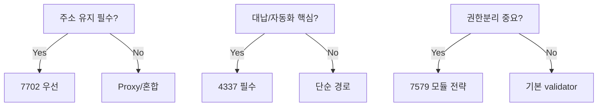

# CTO Track
의사결정 관점에서 보는 7702 + 7579 + 4337

---

## 핵심 의사결정 질문
- 주소 연속성이 핵심인가?
- 운영 복잡도를 감당할 조직이 있는가?
- 보안/규제 요구를 충족 가능한가?

---

## 아키텍처 선택 프레임

---

## 리스크 맵
- 기술: delegate 변경, 모듈 오남용
- 운영: paymaster 비용 폭주
- 조직: 승인 프로세스 부재

---

## 거버넌스 권장안
- root validator 변경: 멀티시그 승인
- module allowlist: 보안 검토 필수
- emergency: nonce invalidation 즉시 실행

---

## 단계적 투자 전략
- Phase 1: MVP(기본 validator + 대납)
- Phase 2: 자동화(session key, limits)
- Phase 3: 고급권한/멀티시그/거버넌스

---

## 성과 지표
- 제품: 전환율, 성공률, 이탈률
- 비용: tx당 원가, sponsor 효율
- 보안: 탐지/회수 MTTR

---

## CTO 결론
- 7702/7579/4337은 기술 선택이 아니라 운영 모델 선택
- 통제 체계와 함께 도입해야 ROI가 나온다
