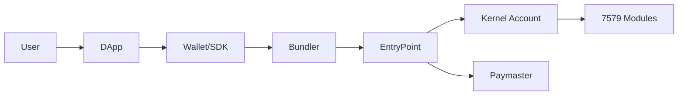
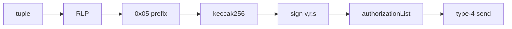

# Engineering Track v2
## ERC-4337 + EIP-7702 + ERC-7579
실제 구현과 파라미터 중심

---

## 1. 오늘의 목표

1. Smart Account 파이프라인을 코드 관점으로 이해
2. 트랜잭션/메시지 포맷을 직접 설명 가능
3. 실패 시 디버깅 순서를 바로 적용 가능

---

## 2. 문제 정의: 왜 EOA만으로 부족한가

- 코드 없는 계정이라 정책 실행 한계
- 권한 분리/자동화/대납을 계정 레벨에서 직접 처리하기 어려움

---

## 3. 해결 구조



---

## 4. ERC-4337 철학

- UserOp(요청 메시지)와 tx(체인 제출) 분리
- 검증/실행/정산을 EntryPoint 경계로 코드화

핵심 actor:
- Bundler / EntryPoint / Account / Paymaster

---

## 5. 4337 버전 변천 요약

- Final 문서와 현업 구현 버전은 분리 설명 필요
- v0.9 기준 포인트:
  - EIP-712 userOpHash 정합성
  - EIP-7702 통합 경로
  - 오프체인-온체인 동기화 중요

---

## 6. EIP-7702 핵심

- authorization tuple: chainId, delegate address, nonce
- authHash = keccak256(0x05 || rlp(tuple))
- signed authorization을 type-4 tx에 포함

---

## 7. 7702 메시지 포맷



---

## 8. ERC-7579 핵심

- validator / executor / fallback / hook
- install / uninstall / replace lifecycle
- account를 모듈형 운영체계로 확장

---

## 9. UserOperation 필수 필드

- sender, nonce, callData
- callGasLimit, verificationGasLimit, preVerificationGas
- maxFeePerGas, maxPriorityFeePerGas
- signature

옵션:
- factory/factoryData
- paymaster 관련 필드

---

## 10. PackedUserOperation 포맷

```mermaid
flowchart TD
  A[initCode = factory || factoryData]
  B[accountGasLimits = verifGas(16B) || callGas(16B)]
  C[gasFees = priorityFee(16B) || maxFee(16B)]
  D[paymasterAndData = paymaster || valGas || postOpGas || data]
  A --> P[PackedUserOperation]
  B --> P
  C --> P
  D --> P
```

---

## 11. userOpHash(v0.9) 계산

```mermaid
flowchart TD
  A[packUserOperation] --> B[structHash]
  B --> C[domainSeparator]
  C --> D[keccak256(0x1901 || domain || structHash)]
  D --> E[account signature]
```

---

## 12. Paymaster 2단계 연동

1. `pm_getPaymasterStubData`
2. `eth_estimateUserOperationGas`
3. `pm_getPaymasterData`
4. 최종 UserOp 제출

---

## 13. Paymaster Envelope 포맷

- 25-byte header + payload
- version/type/flags/validUntil/validAfter/nonce/payloadLen


---

## 14. 코드 매핑 (어디를 봐야 하나)

- Wallet: `apps/wallet-extension`
- DApp: `apps/web`
- SDK: `packages/sdk-ts`, `packages/sdk-go`, `packages/wallet-sdk`
- Service: `services/bundler`, `services/paymaster-proxy`
- Contract: `poc-contract/src/*`

---

## 15. 디버깅 순서

1. chainId / entryPoint
2. nonce 계층(auth vs userOp)
3. hash 입력값
4. gas 필드
5. RPC 에러코드 + on-chain 이벤트 대조

---

## 16. PARTIAL 항목 공개

- Bundler receipt fallback 보완 필요
- 일부 가스 추정 경로 보강 필요
- 7579 fallback selector 충돌 잔존 항목 점검 필요

---

## 17. 데모 시나리오

1. EOA -> 7702 위임
2. Self-paid UserOp
3. Sponsor-paid UserOp
4. 7579 모듈 설치/실행/해제

---

## 18. 결론

- 4337: 실행 파이프라인
- 7702: 전환/호환
- 7579: 확장성
- 핵심은 파라미터/해시/운영정책 정합성
